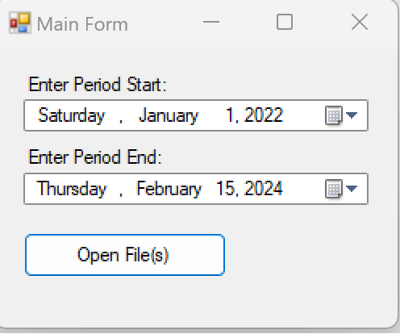
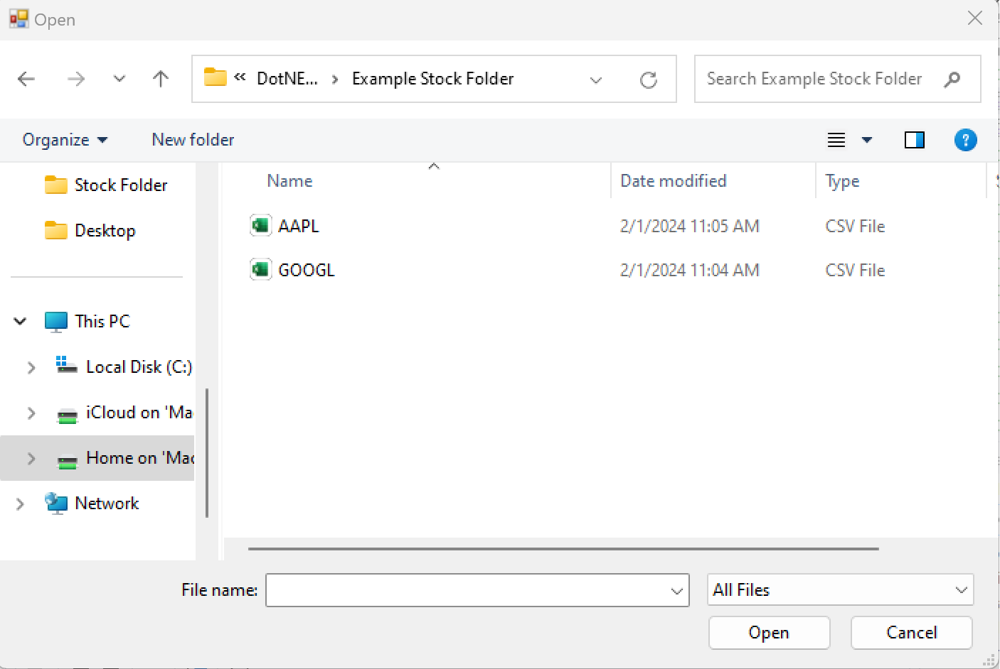
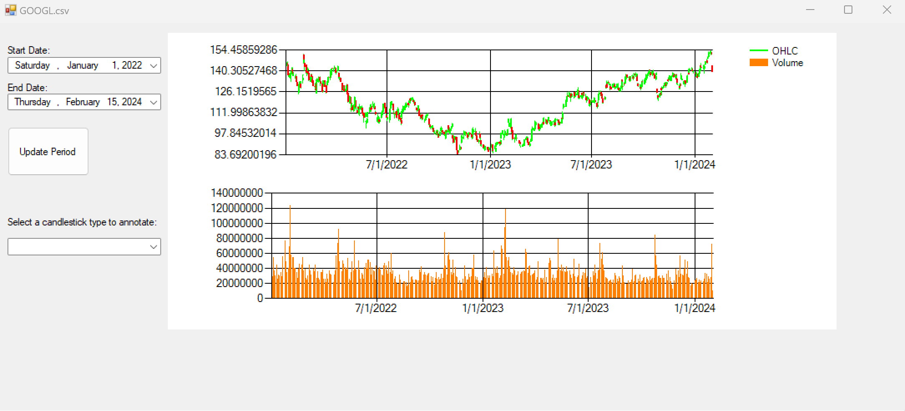
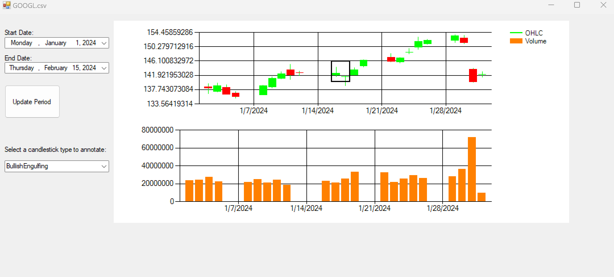
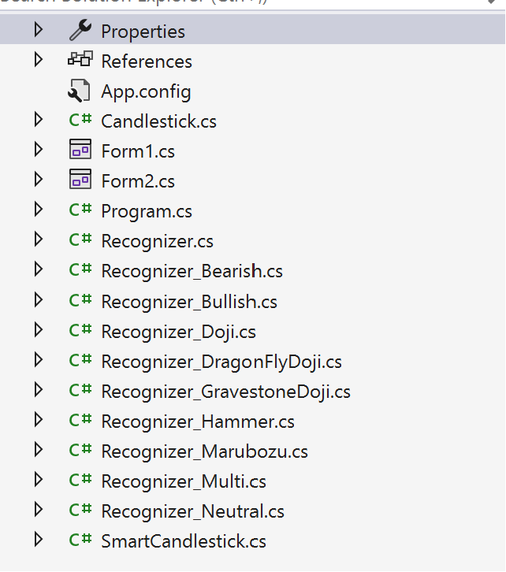

# Stock Candlestick Pattern Detector

## Overview

This project is a Windows Forms Application project. It is designed to allow users to pick multiple stocks and display their candlestick charts. Stocks files can be ANY .csv stock data file downloaded from Yahoo Finance! Each stock is displayed in its own form, with the first stock appearing in the main input form. The application includes the ability to detect and annotate various candlestick patterns.

## Features

- **Multiple Stock Selection**: Users can select multiple stocks, each displayed in a separate form.
- **Normalized Charts**: Charts are normalized to ensure there are no gaps for weekends or holidays.
- **Dynamic ComboBox**: A ComboBox dynamically filled with candlestick patterns that the SmartCandlestick class can detect.
- **Pattern Detection and Annotation**: Users can select a pattern from the ComboBox, and the chart will display annotations for the detected patterns.
- **Data Binding**: Utilizes data binding to load and display OHLC (Open, High, Low, Close) data and volume in candlestick and column chart formats.
- **SmartCandlestick Class**: Extends the basic Candlestick class to include additional properties and methods for pattern detection.

## Installation and Usage

1. **Download the Repository**: Clone the repository to your local machine.
   ```sh
   git clone https://github.com/yourusername/StockCandlestickPatternDetector.git
   ```

2. **Open the Solution**: Open the solution file (.sln) in Visual Studio.

3. **Run the Application**: Build and run the application. The main form will allow you to select stock data files and choose patterns for detection.

4. **Load Stock Data**: Use the OpenFileDialog to select stock data file(s) (.csv). **Ensure you have daily, weekly, and monthly versions of the stock data, this is how yahoo finance formats their stock data files.** The `Example Stock Folder` contains examples of files that can be used.

5. **Select Patterns**: Use the ComboBox to select the desired candlestick pattern for detection. The application will annotate the chart with the detected patterns.

## Project Structure

- **Main Form**: The main input form where users can select stock data and view the first stock's chart.
- **SmartCandlestick Class**: A class derived from the basic Candlestick class with additional properties and methods for pattern detection.
- **Pattern Recognizers**: A set of classes derived from an abstract Recognizer class, each designed to detect specific candlestick patterns.
- **Annotations**: Uses RectangleAnnotation and ArrowAnnotation to highlight detected patterns on the charts.

## SmartCandlestick Class

The `SmartCandlestick` class extends the basic `Candlestick` class and includes the following properties:
- `Range`: The range of the whole candlestick.
- `BodyRange`: The range from open to close.
- `TopPrice`: The larger of the open and close prices.
- `BottomPrice`: The lesser of the open and close prices.
- `UpperTail`: The height of the upper tail.
- `LowerTail`: The height of the lower tail.

The class also includes methods to detect various candlestick patterns such as:
- Bullish
- Bearish
- Neutral
- Marubozu
- Hammer
- Doji
- Dragonfly Doji
- Gravestone Doji

## Screenshots


*Main Form.*


*Select stock folder(s) to display.*


*Displays the stock data in candlestick and volume format.* 


*Displaying detected candlestick patterns with annotations given the combobox selection.*


*Files and code are formated in an Object-Oriented Programming style.* 

## Comments and Documentation

- All functions and methods are commented using `///` comments to explain their purpose, arguments, and return values.
- Each line of code is commented to explain its functionality.
- Any web resources or references used are cited in the comments for future reference.